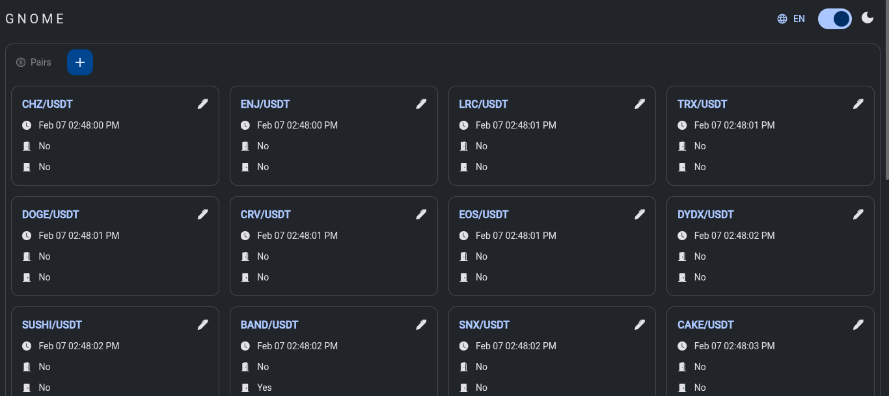
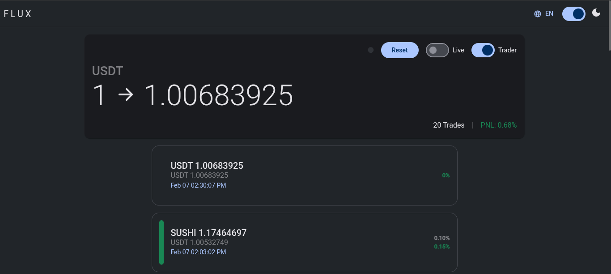
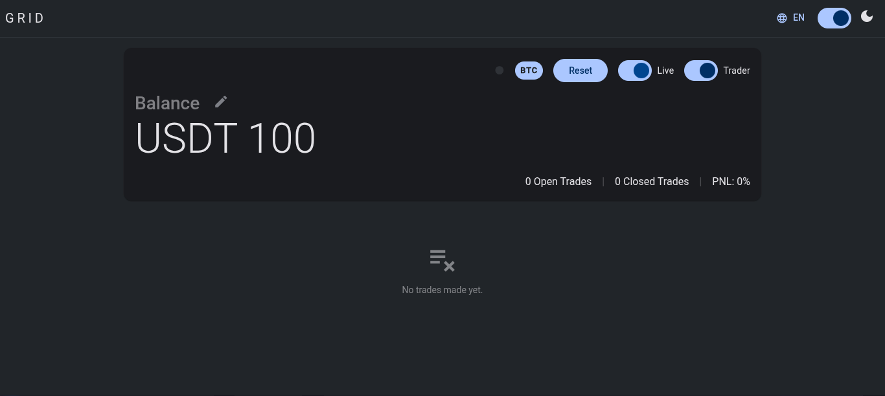
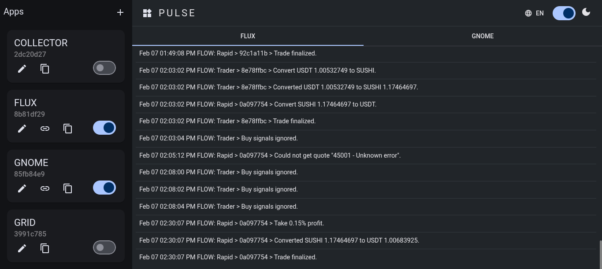
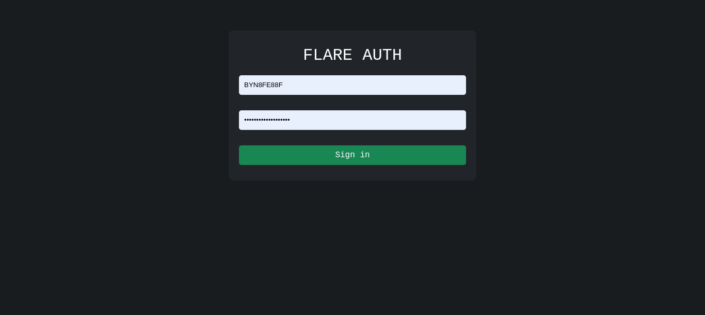

# Flare Trading Network (Public Prototype)

This is a rapid prototype of **Flare**, a scaled-down, speed-optimized, static lightweight version of **The Ark**.

 **The Ark** is a high-yield, high-accuracy crypto trading network utilizing the NodeJs runtime to run its various components to generate highly accurate, AI-enhanced trading signals that can be used for trading in spots, futures, degen and arbitrage markets.

## How it Works

- In making decisions, ***The Ark*** leverages both online and exported neural networks to enhance the accuracy of the outputs from its trading strategies. But its impressive  accuracy is achieved through a process called **Multilayering**. This involves mapping each decision with its predecessor (by representing each decision and how it differs from its predecessor as a character), grouping these characters into "words" based on time, and maintaining a sequence of those words. Once a sufficiently large sequence is collected, the words, decisions are plotted and analysed alongside token rates. This analysis reveals patterns - such as specific words or sequences appearing at key moments, which helps filter out false signals, confirm valid signals, and even predict rate directions by building algorithms or feeding data into additional neural networks (classifiers, time series models).

- The **Multilayering** process builds connections between every decision, the outputs of trading strategies, indicators, patterns, and market data—in ways that aren’t entirely clear even to me—but it appears to be highly accurate and useful.

- In **The Ark**, multilayering is integrated into various components (e.g., DMS, BigChart, Advisory, MonoTRD, Registry, NetManager, etc.) using proprietary algorithms that cannot be disclosed. Dictionaries and exported neural networks are built around this process, making the system highly dynamic.

- In this prototype, **Flare** employs a built-in static version of multilayering through the Gnome component (the successor to DMS) to filter out false signals produced by the active trading strategy. Despite its simplified nature, it remains highly accurate for the trading systems in this prototype. Data was collected and analyzed using the **Watcher** and **Patch** components (which have been redacted from this build), and three-word generic sequences were found to be effective in refining decision signals such as "BULL ENTRY," "BULL EXIT," "BEAR ENTRY," and "BEAR EXIT."

- Most of the network’s components build their trading algorithms around these decisions for spot and futures markets. (Note: The arbitrage and circular arbitrage components, which have been redacted from this build, do not depend on these signals.)


## Architecture

This build of Flare utilizes the BitGet REST APIs and is composed of four components: Gnome, Flux, Grid, and Pulse. Each component can be configured via its environment files and features its own web-based interface—accessible locally via its designated port (e.g., `http://localhost:4000`) and, when deployed remotely, proxied through the Pulse component.

- **Data Persistence**  
    All components use file-based JSON databases powered by custom drivers, RXJS, and Socket.IO for high-speed, reliable persistence and real-time updates across the system.

- **Inter-Component Communication**  
    Socket.IO is used extensively for high-speed broadcasts and communication between components.

- **Configuration**  
    Although most components come preconfigured, each one requires complete environment (.env) configuration before normal operation. Each .env file includes detailed instructions.

- **BitGet Convert Feature**  
    All trading components in this build leverage (only) the BitGet Convert feature, which offers benefits such as lower limits, no fees, sometimes lower (or even profitable) spreads, and the ability to know the exact outcome of a trade before execution—allowing for a halt if necessary.

The components are as follows:

---

1. **GNOME**  

    

    GNOME is named after the wise mythical creature due to its role in generating decision signals for added and active trading pairs, which it then broadcasts to the other components. Pairs can be managed through GNOME’s web interface, and multiple instances can run in parallel by using separate .env files.

    - **Central Loop**  
        GNOME features a central loop that acts as the network’s heartbeat. It runs periodically, fetching market data for each active pair and passing the data to the Analysis class.

    - **Analysis Class**  
        This class processes the market data using a carefully crafted trading strategy that employs numerous indicators and candlestick patterns. It generates various signals such as:

        - **Buy Signals**: `BULL ENTRY`, `BEAR ENTRY` (confirmed reversals), `NO TREND ENTRY`.
        - **Sell Signals**: `BULL EXIT`, `BEAR EXIT`.
        - **No-Action Signals**: `WEAK BEAR`, `WEAK BULL`, `NO TREND NO ACTION`.
    
    - **Data Source Class**  
        After generating signals, the Analysis class forwards them to the Data Source class, which refines the signals using the multilayering mechanism. The refined signals are then sent back to the central loop for broadcast to the network.


    To run this component, configure it via the Pulse component (explained below), or navigate to the gnome directory of the network and run any of the commands below based on your scenario:

    ```bash
        npm start .env.prod
        npm start
        npm start .env
    ```

   If no environment file is specified, the application defaults to using `.env`.

---

2. **FLUX**

    

    Flux (meaning "movement") is a spot trading component that moves a single asset across various tokens to generate profit. Its configurations are defined in an environment file, supporting multiple instances, and its interface allows you to:

    - Toggle trading on/off.

    - Switch between live mode (actual trading) and demo mode (paper trading/testing).

    - Manually close open trades.

    - Reset the component.

    - View past trades and real-time statistics (e.g., PnL).

    Flux uses a base token (typically a stablecoin like USDT) for its balance.

    - **Trading Process**  
        Flux buys a secondary token at a specific rate (opening a trade by converting from the base token) and sells it later at a higher rate (closing the trade by converting back to the base token), thereby profiting from the secondary token’s volatility.

    - **Key Classess**  
        - **Trader Class**  
            Listens for "BUY" signals from GNOME to open trades. It converts assets from the base token to the target token—provided that no trade is currently open, trading is enabled, and all conditions (such as maximum spreads) are met. To ensure all opportunities are utilised, it processes all available buy signals until the conditions are satisfied.

        - **Rapid Class**  
            Responsible for closing trades by converting assets back to the base token. Running on a short interval (e.g., every second), it fetches conversion quotes and checks conditions (profit target reached, stop loss triggered, or profit timeout reached with no loss) to decide when to close the trade.
    
    - **Modes of Operation**  
        In live mode, actual conversions are executed; in demo mode, trades are recorded without performing real conversions.

    Running Flux is similar to running GNOME.
    
---

3. **GRID**

    

    GRID is a spot grid trading bot that, while similar in configuration to Flux, offers several key differences:

    - **Dual Token Setup**  
        GRID uses a "base token" (for balance denomination) and a "trade token" (whose volatility is exploited for profit).

    - **Balance Management and UI**  
        The balance must be set via the user interface before trading begins. The UI also allows you to toggle trading on/off, switch between live and demo modes, manually close trades, reset the component, view active trades, and monitor real-time statistics.

    - **Dynamic Entry Amount**  
        The entry amount for each grid is recalibrated whenever the balance is updated. This allows profits to be reinvested, facilitating exponential growth.

    - **Multiple Trades**  
        GRID can maintain multiple open trades simultaneously. This method ensures continuous trading and scales profits with the number of active grids.

    - **Key Classess**  
        Like Flux, GRID uses two main classes:

        - **Trader Class**  
            Opens a new trade each time a buy signal for the "trade token" is received from GNOME—provided that the maximum number of grids (open trades) has not been reached and all conditions (e.g., maximum spread) are met.

        - **Rapid Class**  
            Runs periodically for each open trade and closes them when specific conditions (similar to those in Flux) are met. After closing a trade, it calculates profits or losses and updates the balance.

    - **Modes of Operation**  
        In live mode, actual conversions are executed; in demo mode, trades are recorded without performing real conversions.

    Running GRID is similar to running GNOME.

    ---


4. **Pulse**  

    

    Pulse is essential—especially in a remote (server) environment—as it serves as the runtime manager for all other components and provides a secure, authenticated gateway to their web interfaces.

    - **Application Management**  
        Pulse lets you configure other components as "apps." Once set up, these apps can be toggled on or off (running as child processes), and Pulse displays their logs in real time.

    - **Security**  
        Pulse features username/password authentication to protect the network’s interfaces from unauthorized access. It also automatically bans IP addresses after a predefined number of invalid login attempts (the ban is lifted only after a process restart).
        

    - **Proxying**  
        Pulse proxies the user interfaces of the running components, including their Socket.IO connections. For example, accessing the /5000 path in your browser will seamlessly display the interface of the component running on port 5000.

    - **Multiple Instances**  
        You can configure multiple instances of a component using separate environment files.

    ---

5. **Snap (Redacted for improvement)**  

    A nice trading experience is achieved when **Flux** and **Grid** are combined into one component called **Snap**. It leverages Flux's ability to utilize entry signals from all pairs on the Gnome, Grid's abilities to not get stuck trying to close a single trade, and recover.

    While testing in low risk conditions (one open trade at a time per pair, high rapid timeout of 24 hours, low numerical TP of 0.7, max grid of 10, USDT 1000, well-established coins), it was able to close 120 trades in 11 hours (some trades very much outlasted others), scalping off just an average of 0.7% from each trade and making a net profit of 8.4% (Total PnL of 84% divided by grid length of 10, USDT 84).

    ---


## Prerequisites

- **Node.js:** Version 18 or higher
- **Web Browser:** Any modern browser

## Installation

1. **Ensure Prerequisites Are Met:**  
    Verify that Node.js and a web browser are installed.

2. **Download the Repository:**  
    Clone or download this repository.

3. **Install Dependencies:**  
    For each component directory (gnome, pulse, flux, grid), run:

    ```bash
    npm install
    ``` 
    Also, configure the environment files (.env) according to your specifications.

4. **Running the Components:**  
    You can either run each component directly from a terminal or start the Pulse component to manage them as a single unit.

5. **Accessing the Interfaces:**  
    Once a component is running, access its web interface by following the URL provided in the console or by clicking the "link" icon in the Pulse app list.

6. **Starting Pulse:**  
    To launch the Pulse interface, navigate to the pulse directory and run:

    ```bash
    npm start
    ```
    Then, open the provided link in your browser.


## Technical Details

- **User Interface**  
    All component interfaces are built with Angular 19, Angular Material, NGX Translate, and the Socket.IO client, among other technologies.

- **Backend**  
    The core components are developed using TypeScript, Express, Axios, Socket.IO, and RXJS. (GNOME also uses Technical Indicators.) Additional tools include Child Processes, HTTP Proxy Middleware, and Express Sessions (for Pulse).

- **Persistence**  
    The system uses high-speed, file-system-based reactive JSON databases powered by custom drivers leveraging RXJS, Socket.IO, Node’s FS and Path modules, and process event listeners.

## Conclusion

- I am not actually supposed to make this Flare prototype (which is just a fragment of the ark, active since July 2024) public, but I am very curious as to what would go wrong if I did.

- As much as it functions and I use it to trade, this product is currenly in development and testing mode, meant to be an optimized successor to ***The Ark*** when done. So it is not out here for you to trade with, but if you decide to, ensure you properly make and test each of your configurations. I am not liable or responsible for any issue you might encounter while using it, this include losses, profits, among others.

- Please note that this build is a fraction of the current **Flare** I use privately, which is also a fraction of **The Ark**, in terms of performance, codebases, projects, e.t.c. The ark is a bit monstrous encompassing projects developed with Javascript, Typescpt and Python, among others.

- If you ever feel the need to reach out to me for any purpose. Please feel free to email me via [gbiangb@gmail.com](mailto:gbiangb@gmail.com). I am currently exploring smart contracts as well, trading (both manual and automated of stocks, ForEx, Crypto Degen, among others), Deep Learning, HuggingFace, LLMs, e.t.c. and would love to collaborate.

## License

This project is free to examine and use for personal or educational purposes. However, please do not redistribute or republish the code without permission.

